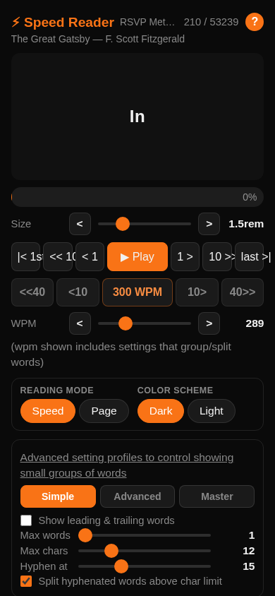
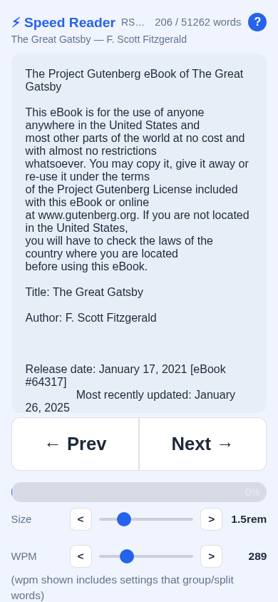

# Speed Reader (RSVP)

**Live site: https://sandbox-vm-kenyon.github.io/rsvp-speed-reader/**

A mobile-first speed reading web app using RSVP (Rapid Serial Visual Presentation) — one word (or word group) at a time in a fixed spot so your eyes never move.

<video src="https://github.com/sandbox-vm-kenyon/rsvp-speed-reader/raw/main/screenshots/rsvp_reader.webm" controls width="100%"></video>

---

## How it works

Traditional reading is slowed by **saccades** — the eye movements your eyes make to jump across a line of text. Each saccade takes 20–200 ms and forces a brief pause. RSVP eliminates saccades entirely by presenting words one at a time in a fixed location. Your eyes stay still; only the words change.

Research shows trained readers can reach 600–1000 WPM with good comprehension using RSVP, compared to a typical 200–300 WPM for conventional reading.

- [Wikipedia — Rapid Serial Visual Presentation](https://en.wikipedia.org/wiki/Rapid_serial_visual_presentation)
- [Acklin & Papesh (2017) — Modern Speed-Reading Apps Do Not Foster Reading Comprehension](https://pubmed.ncbi.nlm.nih.gov/29461715/)
- [Key-DeLyria et al. (2019) — RSVP Interacts with Ambiguity During Sentence Comprehension](https://pubmed.ncbi.nlm.nih.gov/30612265/)

---

## Modes

### Speed (RSVP) mode
One chunk at a time in a fixed spot. Optionally show leading and trailing words for peripheral context without breaking the RSVP effect. Text is selectable.

### Page mode
Shows flowing text with your current reading position highlighted and original line breaks, tabs, and spacing preserved. Switches bidirectionally with Speed mode — position stays in sync. Use Page mode to skip past title pages or a table of contents, then switch back to Speed to resume from that exact word.

---

## Settings

| Setting | Description |
|---|---|
| **Size** | RSVP display font size (0.5–5 rem). |
| **WPM** | Chunk rate; displayed WPM accounts for word grouping and splitting. |
| **Simple / Advanced / Master** | Presets: 1w/10c, 3w/10c, 7w/20c hyphen thresholds. |
| **Max words / Max chars** | Group short words into one chunk (e.g. "and he was"). |
| **Hyphen at** | Hard-split very long strings across chunks. |
| **Split hyphenated words above char limit** | Splits naturally hyphenated words (e.g. "self-aware") at the hyphen before applying the hard-split rule. Supports all Unicode hyphen/dash characters. |
| **Show leading & trailing words** | Context words either side of the current chunk. |
| **Scrub bar** | Drag to jump anywhere; context preview appears while dragging. |
| **Reading Mode** | Speed (RSVP) or Page. |
| **Color Scheme** | Dark (black/orange) or Light (blue/white). |
| **Download txt** | Save the currently loaded text as a .txt file. |

---

## Built-in books

10 public domain classics pre-loaded (Project Gutenberg). Each book opens automatically at the first word of actual content, skipping the Gutenberg preamble:

- The Great Gatsby — F. Scott Fitzgerald *(default)*
- Pride & Prejudice — Jane Austen
- Alice's Adventures in Wonderland — Lewis Carroll
- The Picture of Dorian Gray — Oscar Wilde
- Frankenstein — Mary Shelley
- The Adventures of Tom Sawyer — Mark Twain
- Dracula — Bram Stoker
- Moby-Dick — Herman Melville
- Adventures of Sherlock Holmes — Arthur Conan Doyle
- The War of the Worlds — H.G. Wells

You can also load any `.pdf`, `.txt`, `.md`, or other text file from your device, from a URL, or paste text directly.

---

## Playback controls

| Button | Action |
|---|---|
| `\|< 1st` | Jump to first chunk |
| `<< 10` | Back 10 chunks |
| `< 1` | Back 1 chunk |
| `▶ Play` | Play / pause |
| `1 >` | Forward 1 chunk |
| `10 >>` | Forward 10 chunks |
| `last >\|` | Jump to last chunk |
| `<<40` / `<10` / `300 WPM` / `10>` / `40>>` | Adjust speed |

---

## Keyboard shortcuts

| Key | Action |
|---|---|
| `Space` | Play / pause (Speed mode) |
| `←` | Back 10 chunks |
| `→` | Forward 1 chunk / next page |
| `↑` / `↓` | Speed +50 / −50 WPM |

---

## Screenshots

| Dark / Speed mode | Light / Page mode |
|---|---|
|  |  |
