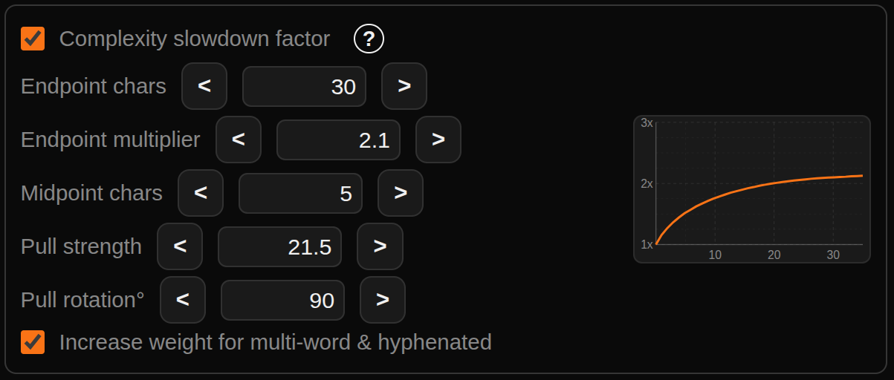

# Speed Reader (RSVP)

**Live site: https://sandbox-vm-kenyon.github.io/rsvp-speed-reader/**

A mobile-first speed reading web app using RSVP (Rapid Serial Visual Presentation) — one word (or word group) at a time in a fixed spot so your eyes never move.

<video src="https://github.com/user-attachments/assets/2a997aca-9370-424b-9b44-7367a497f333" controls width="100%"></video>

---

## RSVP speed reading claims are mostly false!

RSVP, or Rapid Serial Visual Presentation, has gotten recent attention because of speed-reading claims that are unproven in real-world application where retention is actually measured.

### HOWEVER — RSVP enhancements have shown promise for speed and retention

Research indicates that RSVP performance may improve (performance trends positive) when pacing and flow are enhanced. This app explores RSVP configurations associated with those measured improvements to enhance and adjust flow and phrasing.

### RSVP does have proven benefits for people with visual impairments or ADHD

Certain vision impairments have been shown to benefit from RSVP-style reading, and research has been done showing benefits in focus for people with ADHD.

Links:

- RSVP caution / speed-reading limits: [Acklin & Papesh (2017)](https://pubmed.ncbi.nlm.nih.gov/29461715/)
- ADHD / focus-related RSVP benefit: [Cambridge — Reading without eye movements (ADHD)](https://www.cambridge.org/core/journals/journal-of-the-international-neuropsychological-society/article/reading-without-eye-movements-improving-reading-comprehension-in-young-adults-with-attentiondeficithyperactivity-disorder-adhd/33851CEA7C1AC6193D088D4D5551ED3C)
- Visual limitation / peripheral reading training: [ScienceDirect — Vision Research](https://www.sciencedirect.com/science/article/pii/S0042698917301219)
- Phrase/sentence boundary pacing pilot: [Ferguson (Auburn, 2024)](https://bpb-us-e2.wpmucdn.com/wordpress.auburn.edu/dist/a/151/files/2024/08/Ferguson.pdf)

---

## Flow & rhythm

RSVP feel like a 'word-jackhammer' — every chunk
gets the same fixed duration, so short connective words flash by at the same
pace as long, dense ones. Since this doesn't match the natural fluctuation of attention time given to simpler vs more comlex words/phrases, it feels jarring and isn't efficient. Comprehension and comfort seeem to drop with this misalignment.

This app fixes that with a per-chunk **Complexity slowdown** curve. Each chunk's
display time gets a length-aware bump along a quadratic Bezier shape you control
directly:

- **Endpoint chars / multiplier** — where the curve lands (e.g. 30 chars → 2.1×).
- **Midpoint chars** — anchors the control point's x position.
- **Pull strength / rotation°** — moves the control point in polar coordinates,
  letting you bend the curve into a fast-early-rise + plateau, a linear ramp,
  or a slow-start outlier-focused shape.
- **Multi-word & hyphenated** chunks get a length bonus so phrase chunks slow
  down to match their cognitive load.
- **Maintain effective WPM** (compressor-style makeup gain) divides the base
  delay by the mean per-chunk multiplier so the overall reading speed stays at
  your configured WPM — you get the flow shape without losing pace.
- Sentence-ending and transition punctuation pauses are additive, not
  multiplicative, so the maximum slowdown stays predictable.

The net effect: short words still pass quickly, longer/denser chunks hold
slightly longer, sentence endings get a real beat, and the text reads more like
spoken language than a metronome.

---

## Modes

### Speed (RSVP) mode
One chunk at a time in a fixed spot. Optionally show leading and trailing words for peripheral context without breaking the RSVP effect. Text is selectable.

### Page mode
Shows flowing text with your current reading position highlighted and original line breaks, tabs, and spacing preserved. Switches bidirectionally with Speed mode — position stays in sync. Use Page mode to skip past title pages or a table of contents, then switch back to Speed to resume from that exact word.

---

## Settings

| Setting | Description |
|---|---|
| **Size** | RSVP display font size (0.5–5 rem). |
| **WPM** | Chunk rate; displayed WPM accounts for word grouping and splitting. |
| **Configuration profiles** | Simple RSVP (single word, no slowdowns) or Basic / Advanced / Master Speed (grouping + pacing + complexity slowdown). |
| **Max words / Max chars** | Group short words into one chunk (e.g. "and he was"). |
| **Hyphen at** | Hard-split very long strings across chunks. |
| **Split hyphenated words above char limit** | Splits naturally hyphenated words (e.g. "self-aware") at the hyphen before applying the hard-split rule. Supports all Unicode hyphen/dash characters. |
| **Show leading & trailing words** | Context words either side of the current chunk. |
| **Scrub bar** | Drag to jump anywhere; context preview appears while dragging. |
| **Reading Mode** | Speed (RSVP) or Page. |
| **Color Scheme** | Dark (black/orange) or Light (blue/white). |
| **Download txt** | Save the currently loaded text as a .txt file. |

---

## Built-in books

10 public domain classics pre-loaded (Project Gutenberg). Each book opens automatically at the first word of actual content, skipping the Gutenberg preamble:

- The Great Gatsby — F. Scott Fitzgerald *(default)*
- Pride & Prejudice — Jane Austen
- Alice's Adventures in Wonderland — Lewis Carroll
- The Picture of Dorian Gray — Oscar Wilde
- Frankenstein — Mary Shelley
- The Adventures of Tom Sawyer — Mark Twain
- Dracula — Bram Stoker
- Moby-Dick — Herman Melville
- Adventures of Sherlock Holmes — Arthur Conan Doyle
- The War of the Worlds — H.G. Wells

You can also load any `.pdf`, `.txt`, `.md`, or other text file from your device, from a URL, or paste text directly.

---

## Playback controls

| Button | Action |
|---|---|
| `\|< 1st` | Jump to first chunk |
| `<< 10` | Back 10 chunks |
| `< 1` | Back 1 chunk |
| `▶ Play` | Play / pause |
| `1 >` | Forward 1 chunk |
| `10 >>` | Forward 10 chunks |
| `last >\|` | Jump to last chunk |
| `<<40` / `<10` / `300 WPM` / `10>` / `40>>` | Adjust speed |

---

## Keyboard shortcuts

| Key | Action |
|---|---|
| `Space` | Play / pause (Speed mode) |
| `←` | Back 10 chunks |
| `→` | Forward 1 chunk / next page |
| `↑` / `↓` | Speed +50 / −50 WPM |

---

## Screenshots

| Dark / Speed mode | Light / Page mode |
|---|---|
|  |  |
